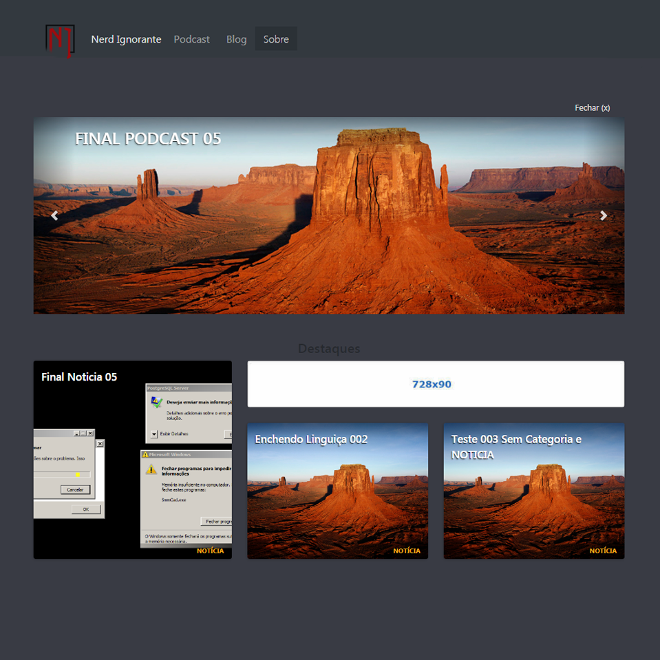

 
 
 

    

 
 
 
#NI knights is a simple yet effective Wordpress theme for podcasters creators
This site was created for the Nerd Ignorante [Nerd Ignorante](www.nerdignorante.com.br))
 
 

<a href="https://bit.ly/arn-wkly">Don't miss out! subscribe to our weekly newsletter</a>

 
 

# Info
- Basic
	- Language: Brazilian Portuguese
	- Wordpress Version: 4.9.5–pt_BR 
	- Tags: blog, two-columns, right-sidebar, fixed-menu, custom-menu, featured-images, post-formats, podcast
	- Fixed Pages: Blog, Home, Nicast, Sobre (About)
	- Fixed Category: Podcast, Notícias (News)
	- Assets: Bootstrap, Jquery
	- Widgets: Internal Ad support System
- Recomendation
	- Plugins: Blubrry from PowerPress, Compress JPEG & PNG images from TinyPNG
	- Actions: Do NOT ERASE Pages and Categories

# Versions
- Alpha
	- 0.7 Not Functional
- Beta
	- 0.8 Raw Meat
		- Ad System in progress
		- Comments not working
		- Still Testing
- Release
	- 1.0 Steak
		- still Frying

<!-- - [Conferences](#conferences)
  - [Chain React Conf - USA](#chain-react-conf---usa)

Many thanks to everyone on the [contributor
list](https://github.com/jondot/awesome-react-native/graphs/contributors)\:)

## Conferences

Conferences dedicated to React Native specifically. A listing of React
general conferences can be found on the [ReactJS
site](https://facebook.github.io/react/docs/conferences.html).

### Chain React Conf - USA

July 11-13, 2018 in Portland, OR - https://infinite.red/ChainReactConf
Twitter: https://twitter.com/chainreactconf Email: conf@infinite.red -->